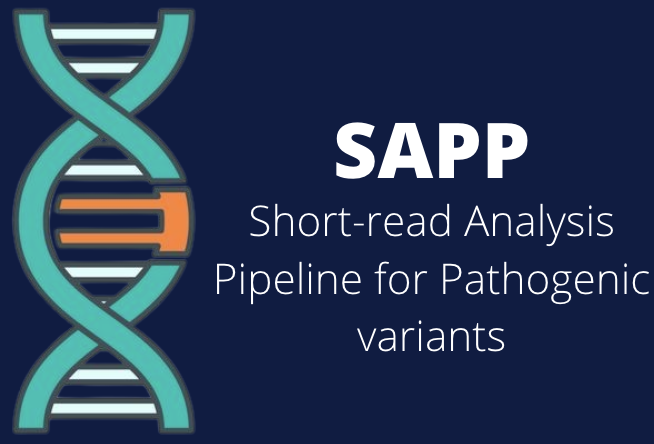
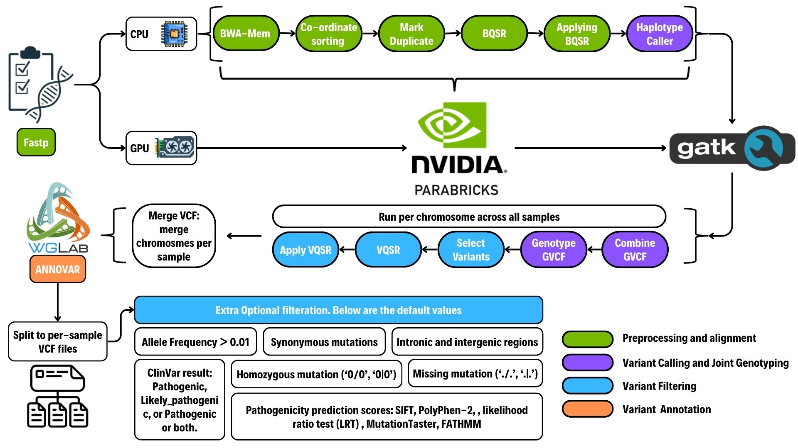
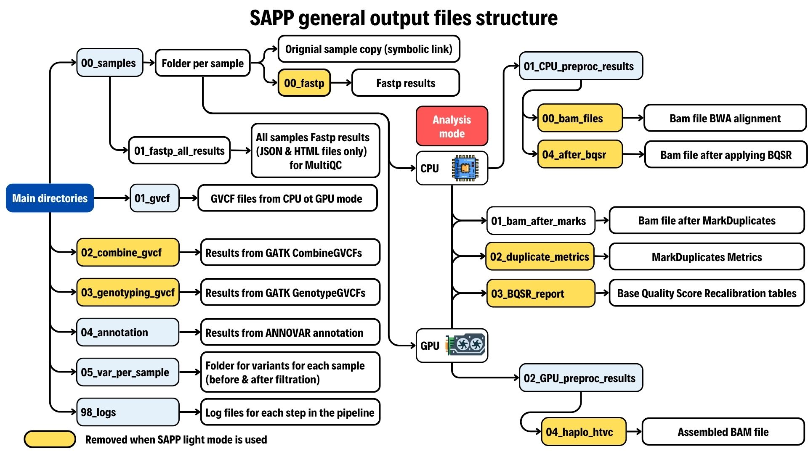

# SAPP: Short-read Analysis Pipeline for Pathogenic variants 

A high-performance cluster (HPC)-compatible pipeline for short-read sequence analysis to identify pathogenic variants. It was optimized and validated on both Sun Grid Engine (SGE) and Slurm job scheduling systems to ensure efficiency and scalability across different HPC environments.

---

### Content

  - [Installation](#installation)
  - [General Usage](#general-usage)
  - [Pipeline Flowchart](#pipeline-flowchart)
  - [Details on the output](#details-on-the-output)
  - [Contributors](#contributors)

---

### Installation

#### System requirements and software dependencies
SAPP runs on HPCs with Slurm job scheduler with Python ver. 3.7 or later. 
The following third-party software/packages are required.  
- Fastp
- Parabricks  
- GATK 
- ANNOVAR
- Singularity
- BWA
- jq 
- Python packages: Pandas
  
#### Source code

1. Cloning the GitHub Repo
```
git clone https://github.com/Mohamed-Elmanzalawi/Human_Variant_Analysis_Pipeline.git
```
  
2. Download Mamba or Conda  
   Please use the instructions on the official websites:  
   **Conda:** https://docs.conda.io/projects/conda/en/latest/user-guide/install/index.html  
   **Mamba:** https://mamba.readthedocs.io/en/latest/installation/mamba-installation.html  
   
4. Create the virtual environment
```
mamba env create -f environment.yml
```
Activate the environment
```
mamba activate biotools 
```

4. Download the reference genomes from the GATK bundle  
   **Official site:** https://console.cloud.google.com/storage/browser/genomics-public-data/resources/broad/hg38/v0?invt=AbuWvg  
   You can also simply run the script ```01_download_GATK_hg38_v0.sh``` and download all of them in one step using the command below.
```
bash 01_download_GATK_hg38_v0.sh
```
You will find them in the folder named ```00_resources/01_reference38```  
**Note**: The pipeline is compatible with the GATK reference genome since GATK is used in most of the analysis. However, if you want to use another reference genome, be sure to change this in your main config file ```e99_config.json``` and provide the index and dictionary files for that reference genome in the same folder.
  
5. Download ANNOVAR and its databases  
   **Official site:** https://annovar.openbioinformatics.org/en/latest/user-guide/download/  
   You can also run the script ```01_download_annovar.sh``` to download all of them in one step using the command below.   
```
bash 01_download_annovar.sh
```
You will find them in the folder named ```00_resources/02_annovar```  
**Note**: The databases downloaded using the command above might be outdated, so it is advised to check the official website regularly and use the latest databases.

6. Build singularities containers  
- **For GATK:**
```
singularity build gatk_latest.sif docker://broadinstitute/gatk:latest
```
**Note:** The script has been tested and is working accurately for GATK version 4.6.2.0, so it is advised to use this version in case any compatibility issues occur in the future
```
singularity build gatk_4.6.2.0.sif docker pull broadinstitute/gatk:4.6.2.0
```

- **For Parabricks:**
```
singularity build parabricker4.3.1-1.sif docker:nvcr.io/nvidia/clara/clara-parabricks:4.3.1-1
```

7. Adjust the config file `e99_config.json`  
  :star::star: **This is a very important step as it defines the exact parameters that the pipeline will follow. Ideally, you will only need to do this step once and upon running the pipeline again, you can use the same config file.
   For each parameter in `e99_config.json`, there is a comment explaining in detail what you should write.**
   
   The parameters include, but are not limited to, the output file location, the path to Singularity containers for GATK and Parabricks, and the HPC nodes used in the analysis.

---

### General Usage  
```
bash A00_SAPP_master.sh -c -l
```

SAPP can use both CPU and GPU nodes.  
Using `-c`, the pipeline will run the CPU commands from the alignment step to haplotype calling.  
Using `-g`, the pipeline will run Parabricks that run the alignment step to haplotype calling, relying on GPU nodes, which is much faster.  
**If you want to run the pipeline for different analyses at the same time, simply create a config file for each one and use the option `--config` to specify the chosen config file.**   
```
Usage: A00_SAPP_master.sh [-h] [-g | --gpu] [-c | --cpu] [-l | --light_mode] [--config <config_file>]
Options:
  -h, --help  Show help message
  -g, --gpu             Run in GPU mode 
  -c, --cpu             Run in CPU mode 
  -l, --light_mode      Run in light mode that significantly reduces the size of the output files.
  --config              Specify the config file (default: e99_config.json)

```

### Pipeline Flowchart   


**Overview of SAPP components and workflow.** 

### Details on the output

The pipeline will save all outputs to the output folder assigned in the `e99_config,json`.  
⭐**You will Also find a merged file with all the variants from every sample combined after filteration in your ```05_var_per_sample``` folder under the name ```merged_vars.txt```.**  

Below is a schematic showing the SAPP general output files structure.



### Contributors  

* [Mohamed Elmanzalawi](https://github.com/Mohamed-Elmanzalawi), Department of Informatics, National Institute of Genetics, The Graduate University for Advanced Studies (SOKENDAI) 


